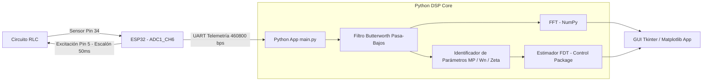

# ⚙️ Sistema de Adquisición y Procesamiento Digital de Señales RLC (DSP)

[](LICENSE)
[](https://www.python.org/)
[](https://www.espressif.com/en/products/socs/esp32)
[]()

Plataforma integrada de hardware y software para la captura a alta velocidad, acondicionamiento y caracterización temporal/frecuencial de la respuesta transitoria en circuitos eléctricos subamortiguados de segundo orden (RLC).

---

## 👥 Autores / Integrantes

* **Juan Manuel Gonzalez Banguero**
* **Luis José Pinto Gonzalez**
* **Andres David Nazarith Gomez**

---

## 📌 Descripción del Proyecto

Este sistema implementa una plataforma de adquisición y análisis digital de señales optimizada para circuitos RLC. Un microcontrolador **ESP32** genera un pulso de excitación escalón (50 ms) y realiza un muestreo analógico de alta velocidad del voltaje de respuesta almacenando hasta 35,000 muestras en RAM durante un intervalo total de 100 ms.

Los datos capturados son transmitidos por ráfaga (*burst*) vía UART a **460,800 baudios** hacia una aplicación en **Python**, la cual ejecuta:

1. **Filtrado Digital:** Eliminación de ruido mediante un filtro pasa-bajos Butterworth de 4to orden con fase cero (`filtfilt`).
2. **Análisis Espectral (FFT):** Derivación discreta para eliminar la componente DC, enventanado de Hanning y estimación espectral rápida.
3. **Identificación Dinámica:** Estimación del sobreimpulso ($M_p$), factor de amortiguamiento ($\zeta$), frecuencia natural ($\omega_n$) y función de transferencia en el dominio de Laplace $G(s)$.

---

## 📐 Modelo Matemático y Condición de Diseño

La ecuación diferencial de segundo orden que gobierna el voltaje del capacitor $V_c(t)$ en un circuito RLC serie es:

$$
LC \frac{d^2V_c(t)}{dt^2} + RC \frac{dV_c(t)}{dt} + V_c(t) = V_{\text{in}}(t)
$$

Aplicando la Transformada de Laplace con condiciones iniciales nulas:

$$
G(s) = \frac{V_c(s)}{V_{\text{in}}(s)} = \frac{\omega_n^2}{s^2 + 2\zeta\omega_n s + \omega_n^2}
$$

Para garantizar una **respuesta subamortiguada** con oscilaciones transitorias medibles, se satisface la condición analítica:

$$
R < 2 \sqrt{\frac{L}{C}}
$$

---

## 🏗️ Arquitectura del Sistema



---

## 💻 Estructura del Repositorio

```
Proyecto DSP/
├── main.py                 # Punto de entrada principal (lanza la GUI)
├── test_proyecto.py        # Script de prueba y validación automatizada
├── import_check.py         # Verificación rápida de importación de módulos
├── Requerimientos.txt      # Dependencias de Python (NumPy, SciPy, Matplotlib, Control)
├── README.md               # Documentación del proyecto
├── ESP32/                  # Proyecto PlatformIO para el firmware
│   ├── platformio.ini      # Configuración de compilación y velocidad serial
│   └── src/
│       └── firmware.ino    # Código C++ para captura en RAM a 460,800 baudios
├── Procesamiento/          # Módulos de filtrado, FFT, FDT y parámetros
│   ├── data.py             # Almacenamiento y carga de datos CSV en results/data/
│   ├── fdt.py              # Generación de la función de transferencia Laplace
│   ├── fft.py              # Analizador espectral FFT con ventana de Hanning
│   ├── filtro.py           # Filtro Butterworth pasa-bajos y normalización
│   └── parametros_dinamicos.py # Algoritmo de identificación del sistema
├── Adquisición_de_datos/   # Módulo de comunicación serial con ESP32
│   └── muestreo.py         # Gestión de comandos e ingesta de ráfaga
├── GUI/                    # Interfaz gráfica de usuario en Tkinter
│   ├── app.py              # Aplicación GUI principal
│   ├── ventana.py          # Ventanas y trazado de gráficos
│   └── botones.py          # Componentes interactivos de usuario
└── results/                # Directorio de resultados
    └── data/               # Archivos CSV de lecturas guardadas
```

---

## 🚀 Requisitos e Instalación

### Hardware

* Microcontrolador ESP32 (DevKit v1).
* Circuito RLC (Pin de Excitación: `GPIO 5`, Pin de Sensor ADC: `GPIO 34`).
* Cable USB para comunicación serial UART.

### Software (Python 3.8+)

Clona el repositorio e instala las dependencias necesarias:

```bash
git clone https://github.com/TU_USUARIO/Proyecto_DSP.git
cd "Proyecto DSP"
pip install -r Requerimientos.txt
```

---

## 🏃 Modo de Uso

### 1. Compilar y Cargar Firmware ESP32

Utilizando PlatformIO desde la terminal o VS Code:

```bash
cd ESP32
platformio run --target upload
```

### 2. Ejecutar la Aplicación Principal

Desde la raíz del proyecto:

```bash
python main.py
```

### 3. Ejecutar Pruebas Automatizadas

Para verificar el correcto funcionamiento del pipeline DSP con datos sintéticos:

```bash
python test_proyecto.py
```

---

## 📊 Métricas de Desempeño

* **Velocidad Serial:** $460,800\,\text{baudios}$ (Transferencia en tiempo real de ráfaga).
* **Resolución ADC:** $12\,\text{bits}$ ($0 - 3.3\,\text{V}$).
* **Capacidad de Muestreo:** Hasta $35,000$ puntos por ciclo de captura ($100\,\text{ms}$).
* **Reducción de Ruido:** Eliminación de armónicos no deseados respetando la sobreoscilación pico ($M_p$) para estimación precisa de $\zeta$ y $\omega_n$.

---

## 📄 Licencia

Este proyecto está bajo la Licencia MIT
